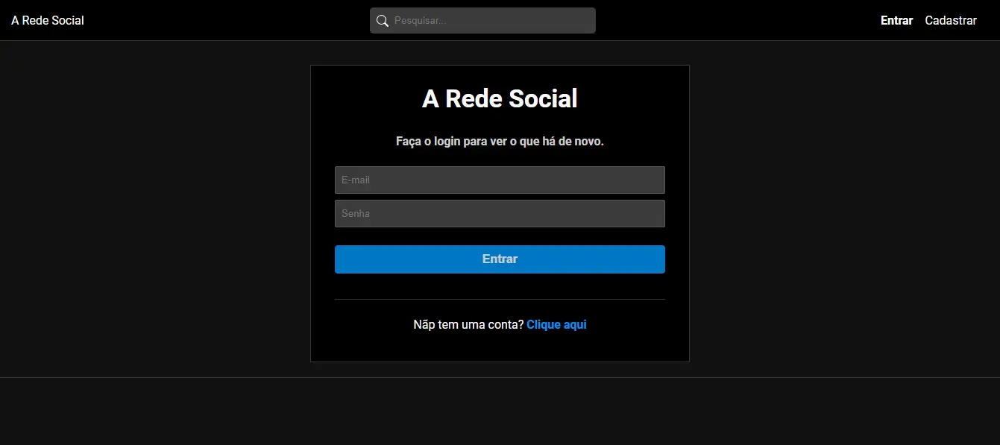

# A Rede Social

**A Rede Social** é um projeto que oferece uma experiência semelhante à do Instagram, desenvolvido com React. Este sistema completo abrange tanto o backend quanto o frontend, permitindo que os usuários criem suas contas, publiquem fotos e explorem as imagens compartilhadas por outros usuários.



## 🚀 Funcionalidades

- **Criação de Conta e Login de Usuário:** Permita que os usuários se registrem e acessem suas contas.
- **Edição de Perfil:** Os usuários podem atualizar suas informações pessoais, incluindo senha e imagem de perfil.
- **Feed de Publicações:** Visualize um feed com todas as publicações (fotos) feitas por outros usuários, além das suas, incluindo títulos, curtidas e comentários.
- **Detalhes da Publicação:** Acesse a visualização completa de cada publicação, onde é possível ver a foto, título, número de curtidas e comentários.
- **Perfis de Usuários:** Explore os perfis de outros usuários e descubra suas publicações.
- **Interações em Publicações:** Curta e comente nas publicações (fotos) de outros usuários, além das suas.
- **Gerenciamento de Publicações:** Os usuários podem criar, editar e excluir suas próprias publicações (fotos), incluindo a opção de adicionar título, curtidas e comentários.
- **Pesquisa de Publicações:** Encontre publicações específicas através de uma busca por título.

## 📋 Pré-requisitos

Antes de começar, verifique se você possui [Node.js](https://nodejs.org/) instalado em sua máquina, que você tenha uma conta no **[MongoDB Atlas](https://www.mongodb.com/cloud/atlas)** e que o banco de dados já esteja configurado, pois este projeto utiliza o banco de dados na nuvem.

## 🔧 Instalação

O projeto está dividido em duas partes: **backend** e **frontend**. Siga as instruções abaixo para instalar cada parte.

### Backend

1. Clone o repositório para o seu ambiente local:
   ```bash
   git clone https://github.com/ErosNetto/A-Rede-Social.git
   ```
2. Navegue até o diretório do backend:

   ```bash
   cd A-Rede-Social/backend
   ```

3. Instale as dependências:
   ```bash
   npm install
   ```
4. Crie um arquivo .env na raiz do projeto e adicione suas variáveis de ambiente:

   ```bash
    PORT=5000
    DB_USER=seu_usuario
    DB_PASS=sua_senha
    DBNAMEANDCLUSTER=nome_do_seu_banco
    JWT_SECRET=aRedeSocial
    TOKEN_EXPIRES=7d
   ```

   Exemplo da string de conexão do MongoDB Atlas:

   ```
   mongodb+srv://${dbUser}:${dbPassword}@${dbNameAndCluster}/?retryWrites=true&w=majority
   ```

5. Inicie o servidor de desenvolvimento:
   ```bash
   npm run server
   ```

### Frontend

1. Navegue até o diretório do frontend:

   ```bash
   cd A-Rede-Social/frontend
   ```

2. Instale as dependências:
   ```bash
   npm install
   ```
3. Inicie o servidor de desenvolvimento:
   ```bash
   npm run dev
   ```

## 🛠️ Tecnologias utilizadas

- **[React](https://reactjs.org/)** - Uma biblioteca JavaScript para construção de interfaces de usuário.
- **[Redux](https://redux.js.org/)** - Uma biblioteca para gerenciamento de estado em aplicações JavaScript.
- **[React Router](https://reactrouter.com/)** - Uma biblioteca que permite a navegação entre diferentes componentes em aplicações React.
- **[React Icons](https://react-icons.github.io/react-icons/)** - Uma coleção de ícones SVG que podem ser facilmente integrados ao seu projeto React.
- **[Express](https://expressjs.com/)** - Um framework para Node.js que facilita a criação de aplicações web.
- **[Express Validator](https://express-validator.github.io/docs/)** - Um middleware para validação e sanitização de dados em aplicações Express.
- **[MongoDB](https://www.mongodb.com/)** - Um banco de dados NoSQL orientado a documentos.
- **[Mongoose](https://mongoosejs.com/)** - Uma biblioteca para modelar dados em MongoDB.
- **[Multer](https://github.com/expressjs/multer)** - Um middleware para manipulação de `multipart/form-data`, usado para upload de arquivos.
- **[Bcryptjs](https://github.com/dcodeIO/bcrypt.js)** - Uma biblioteca para hash de senhas.
- **[Jsonwebtoken](https://jwt.io/)** - Uma biblioteca para implementação de autenticação baseada em JSON Web Tokens.
- **[CSS](https://www.w3schools.com/css/)** - Para estilização e layout da aplicação.

## 🖇️ Contribuições

Contribuições são sempre bem-vindas! Se você gostaria de ajudar a melhorar este projeto ou personalizá-lo ao seu gosto, siga as etapas abaixo:

1. **Fork este repositório:** Crie uma cópia em sua conta do GitHub.
2. **Crie uma nova branch:** Para sua funcionalidade ou correção de bug.
3. **Faça suas alterações:** Sinta-se à vontade para modificar o projeto da maneira que desejar!
4. **Commit suas alterações:** Envie suas alterações para o repositório do seu fork.
5. **Abra um Pull Request:** No repositório original, para que suas alterações possam ser revisadas.

Agradeço por suas contribuições!

## 📄 Licença

Este projeto está licenciado sob a licença MIT. Para mais detalhes, veja o arquivo [LICENSE.md](https://github.com/ErosNetto/A-Rede-Social/blob/main/LICENSE).
